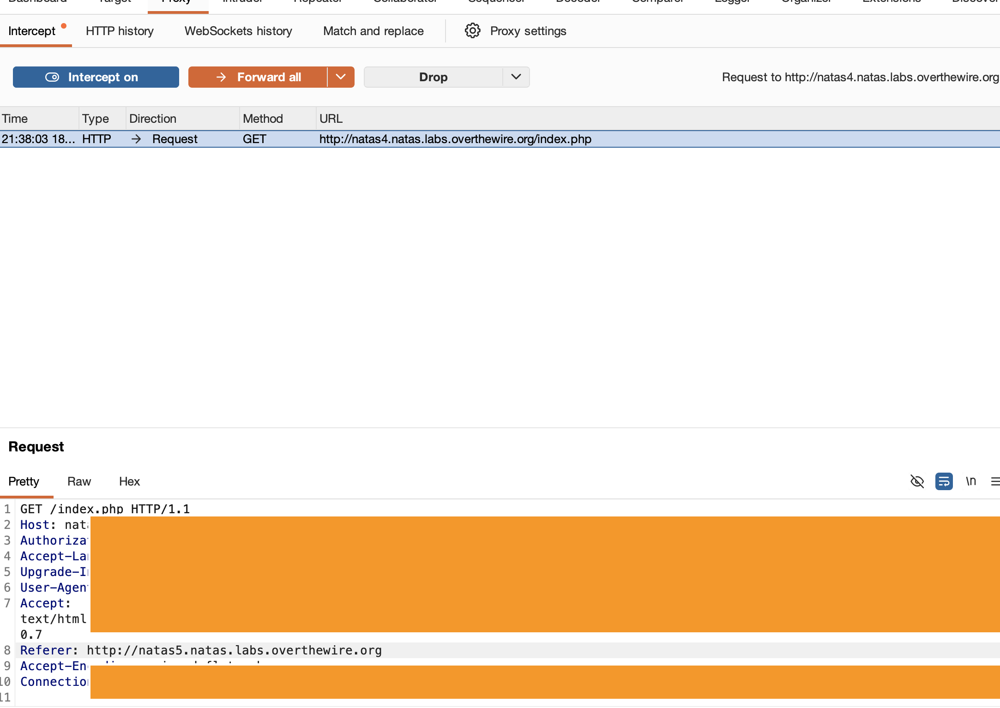

# Category

web

# Overview

Access disallowed. You are visiting from "" while authorized users should come only from "http://natas5.natas.labs.overthewire.org/"

# Analysis

`Refresh page`를 클릭 시 `/index.php`로 이동하며 화면에 보여지는 문구에 어디로부터 방문했는지에 대한 부분이 이동 전 페이지 주소였던 `http://natas4.natas.labs.overthewire.org/`로 변경이 되었다.

```
Access disallowed. You are visiting from "http://natas4.natas.labs.overthewire.org/" while authorized users should come only from "http://natas5.natas.labs.overthewire.org/"
```

이를 통해 사이트에서 `referer`의 정보를 통해서 통과 여부를 결정한다는 것을 추측할 수 있다.

# Exploitation

버프 스위트를 통해 `Refresh page`클릭 시 보내는 메시지의 `referer`값을 문제에서 표시된 `http://natas5.natas.labs.overthewire.org/`로 변경하여 다음 비밀번호를 알 수 있다.



# Flag

`0n...oK`
