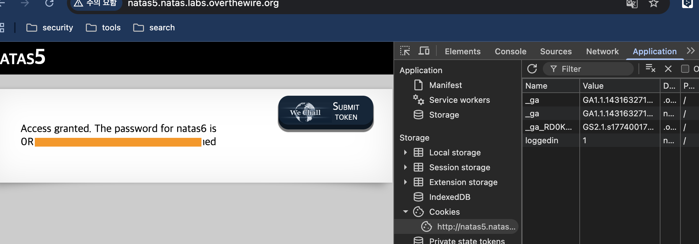

# Category

web

# Overview

Access disallowed. You are not logged in

# Analysis

로그인이 되어있지 않다라는 메시지를 통해 jwt나 cookie 관련 요소를 확인해보기 위해 페이지 요청과 응답 헤더를 살펴본 결과 `Set-Cookie` 부분에 `loggedin=0` 쿠키가 심어져 응답된 것을 알 수 있다.
또한 Application cookies에 `name: loggedin, value: 0`을 확인할 수 있다.

# Exploitation

`loggedin`의 값을 `true`를 의미하는 `1`로 변경하여 다시 페이지 요청 시 다음 비밀번호를 얻을 수 있다.

# Flag

`0R...ed`
